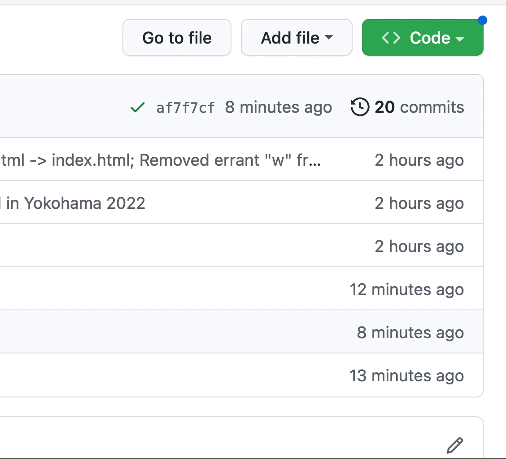

# Downloading Files Using the Github UI

If you prefer the flow of downloading and uploading files/folders like an FTP server, the Github website recreates a lot of the features users are used to with FTP.

When downloading, Github offers the ability to download an entire repository, but not individual folders. Below are the steps to download the entire repository.

1. On GitHub.com, navigate to the main page of the repository, or go here: [https://github.com/htincentives/trips.htincentives.com].
2. Above the list of files, using the **Code** drop-down, click **Download Zip**.  This will download a zip file of the entire repository.
3. Unzip this file and any of these files can now be used to replace your local files or folders.
